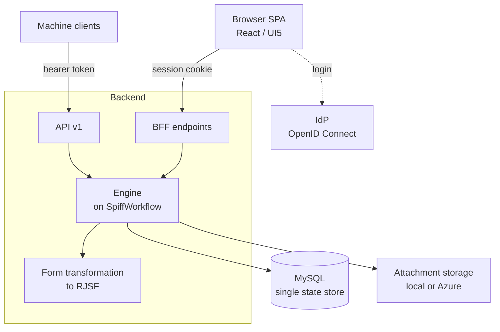

# Architecture

This page gives architects and new workflow-project developers the mental model of the engine: which parts exist, where state lives, and how a workflow becomes something a user fills in. This handbook illustrates everything with one running example, an expense-approval workflow: an employee submits an expense, small amounts are auto-approved, larger ones go to a finance approver. Each part below carries its own explanation and has its own page under Related; this one is the map.

## The pieces

The engine ships as one Docker image, the runtime image: a web server that serves the browser application and the backend that runs the workflows. A workflow project — the `expenses` project in our example — is a Python package installed on top of that image (see below).

When the employee opens the Enter-Expense form, the browser SPA (React with the UI5 component set) is talking to the BFF: endpoints protected by the session cookie and the role `wf-user`. A separate machine-to-machine surface, API v1, is protected by a bearer token and the role `wf-api`; external systems use it to send messages to workflows — the browser never touches it. The engine has no users of its own; the employee's login goes through an external IdP (see [operations.md](operations.md)).

## State and storage

Every submit lands in MySQL, the single state store. Each workflow instance — one run of the expense workflow — is written whole as one serialized blob that holds the parsed workflow and all task data; next to it the engine keeps one row per task with the fields the UI queries (state, lane, assignee), plus users, sessions, messages, timers and migration state. The engine writes the whole blob back on every change, so if the employee and the approver were to submit on the same workflow instance at once, one write could overwrite the other. The uploaded receipt is the one exception: attachment file content lives in separate storage, a local directory or Azure Blob (see [operations.md](operations.md) and [data-models.md](data-models.md)).

## The engine

The engine runs BPMN on top of the SpiffWorkflow library. When an employee starts an expense, the engine parses the BPMN and the forms once and freezes that copy into the instance; running instances are never migrated, so changing the process or a form only affects expenses started afterwards. After the submit form, a service task named `check_policy` flags whether the amount needs approval, and a gateway routes on it: expressions in sequence flows, timers and correlation keys are evaluated as Python — a leading `=` is rewritten to Python by text replacement, not run by a real FEEL engine — so the approval gateway compares the amount with `=amount > 1000`. The engine maps a service task's `type` to the matching service function in the workflow module by name; unlike the frozen BPMN, that function is not frozen into the instance, so redeployed Python code runs even for expenses already in flight. How you model all of this is on [workflows.md](workflows.md).

## Forms and hide-if

Form rendering is a distinct layer: form transformation to RJSF. The Enter-Expense `.form` file is transformed once into a JSON schema (the data) and a UI schema (the layout and widgets), and the frontend renders and validates that with RJSF (react-jsonschema-form). The transformed schemas travel frozen with the workflow instance.

Conditional field visibility (hide-if) — for example a travel-details field shown only when the category is Travel — is split across the two sides. The browser evaluates the full FEEL condition on every change and hides the field; on submit the backend re-checks it and drops the values of hidden fields, but with only a subset of FEEL. That subset is equality and boolean logic (`=`, `!=`, `and`, `or`) — no `<` or `>` as the gateway uses. Keep hide-if expressions inside it so browser and backend agree; the how-to and the exact subset are on [workflows.md](workflows.md).

## Workflow projects

The `expenses` project is a Python package layered on top of the engine image. It adds workflows, connectors ([connectors.md](connectors.md)), data models ([data-models.md](data-models.md)) and more; the engine finds it through packaging entry points at startup, with no engine-side configuration. Creating one is on [workflow-project.md](workflow-project.md); building and running the image is on [operations.md](operations.md).

## Related

- [workflow-project.md](workflow-project.md) — create and run a workflow project
- [workflows.md](workflows.md) — model processes, forms, service tasks, hide-if
- [connectors.md](connectors.md) — talk to external systems
- [data-models.md](data-models.md) — data models and attachment storage
- [operations.md](operations.md) — build the image, settings, identity provider, storage
- [ADR 002](adr/adr_002_extension_architecture.md) — workflow project architecture
