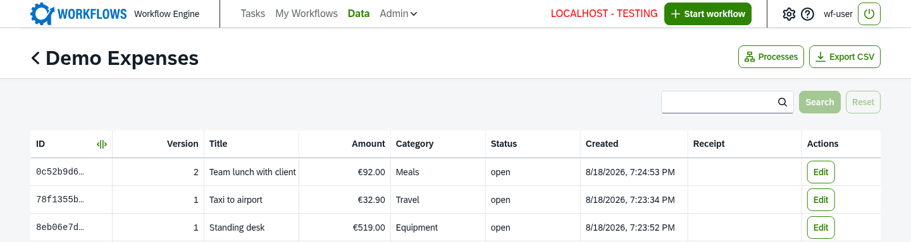
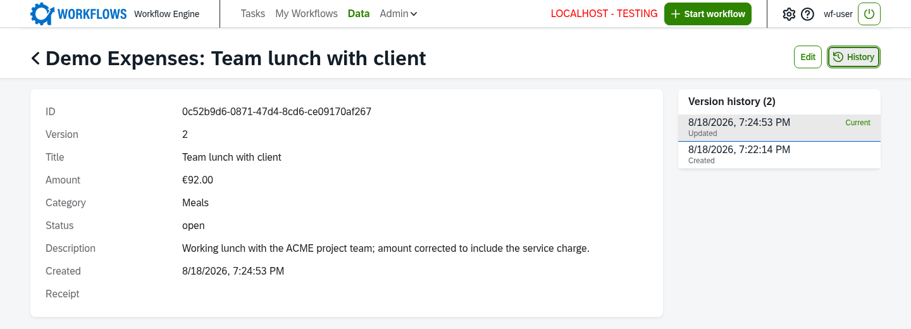

# Data models

A workflow instance is temporary: it runs, finishes, and its task data is history. But the record it produced often has to outlive it. This handbook illustrates everything with one running example, an expense-approval workflow: an employee submits an expense, small amounts are auto-approved, larger ones go to a finance approver, and the approved result is filed for finance. That approved expense is exactly such a record — finance still needs to see, correct, and export it long after the `ExpenseApproval` instance is gone. The engine's answer is a data model: a database table your project defines and the engine hosts in its own database, written from service functions and, when you want, shown to users on the Data page. This page shows how to define the `Expense` model, use it from a service function, expose it, and ship its table with a migration.



*The `Expense` model on the Data page. Each row is the current version of a record; the amount uses a currency format, the version column tracks history, and the row action starts a follow-up workflow.*

Every table name carries the prefix `ext_<namespace>_`, where the namespace is your project's own short prefix — `expenses` here, so the table is `ext_expenses_expense`. Tables of different projects never collide with each other or with engine tables. Workflow writes share the engine's transaction: when a service function fails, its data model writes are rolled back with the task, so a half-approved expense is never left behind.

## Three tiers

The engine offers three tiers that build on each other, and this handbook builds on the top one: workflow-managed. It is the tier for records that workflows create and users see, the only tier that can be exposed via the API, and what a record like an approved expense uses. On top of a stable `id` it adds the workflow instance that wrote each version, an action label, and a reserved `title` — the record's human-readable name, which the workflow writes like any column and the API always delivers, searchable and sortable. It never updates a row in place: a write with no id creates a new record, a write that reuses an existing id adds the next version and makes it current.

The two lower tiers are not exposable and are not the subject of this page. A *plain* model gives each record a stable `id` and one row, for lookup and configuration tables edited in place; a *versioned* model adds a version number, a current flag and a creation time, keeping every change as a new row, for internal data whose history matters.

## Define the model

Base the class on the tier you need. `Expense` extends the project's own model base — which fixes the `ext_expenses_` prefix — and the workflow-managed mixin, which contributes the stable `id`, the version columns, the `workflow_instance_id` provenance, and the reserved `title`. You add only the business columns, and you never declare a `title` column of your own — the mixin's would be shadowed and registration would fail.

```python
from decimal import Decimal

from sqlalchemy import Numeric, String, Text
from sqlalchemy.orm import Mapped, mapped_column

from actidoo_wfe.wf.models import WorkflowManagedMixin, extension_model_base

Base = extension_model_base("expenses")


class Expense(Base, WorkflowManagedMixin):
    _ext_table = "expense"  # -> table ext_expenses_expense

    amount: Mapped[Decimal | None] = mapped_column(Numeric(10, 2), nullable=True)
    category: Mapped[str | None] = mapped_column(String(100), nullable=True)
    status: Mapped[str | None] = mapped_column(String(50), nullable=True)
    description: Mapped[str | None] = mapped_column(Text, nullable=True)
```

The receipt the employee uploaded is not a column here: file fields are framework-managed and their references live in a side table, written through the task helper (see below). The module holding this class must be reachable by the [Venusian scan](glossary.md#venusian-scan), or the engine never learns about the model. Registration is checked at startup: an API declaration on a model that is not workflow-managed fails, empty read roles fail, a declared field that matches no column fails, and an action whose target workflow cannot be loaded stops the engine.

A workflow reaches only the models it declares. In the [workflow module](glossary.md#workflow-module) of every workflow that touches `Expense` — `ExpenseApproval` and the correction workflow both do — list it:

```python
DATA_MODELS = ["Expense"]
```

When the module defines `__all__`, add `DATA_MODELS` to it as well, otherwise the allow-list is empty. A function that asks for a model not in `DATA_MODELS` is denied; the error names the models the workflow may use.

## Expose the model

Registering the class is what makes the engine host its table; adding an API declaration to that registration is what puts it on the Data page and behind the read-only BFF. Read access is deny-by-default: the declaration must name the roles whose members may read the model, or `*` for every workflow user. For `Expense`, finance approvers and a wider viewer role may read it, an amount renders as euro currency, the free-text description is kept off the crowded table list, the receipt file is left out of the CSV export, and a `Correct` action lets a reader start a correction workflow from a row.

```python
from actidoo_wfe.wf.config_data_model import ActionDef, FieldDef, WorkflowDataApiConfig
from actidoo_wfe.wf.registry_data_model import register_data_model

register_data_model(
    name="Expense",
    api=WorkflowDataApiConfig(
        label="Expenses",
        read_roles=["expense-approver", "expense-viewer"],
        fields=[
            FieldDef("amount", type="decimal", format="currency:EUR", label="Amount"),
            FieldDef("category", label="Category"),
            FieldDef("status", label="Status"),
            FieldDef("description", label="Description", include_in_table=False),
            FieldDef("receipt", type="file", label="Receipt", include_in_csv=False),
        ],
        actions=[
            ActionDef(
                key="correct",
                label="Correct",
                target="ExpenseCorrection",
                payload=lambda row: {"source_id": str(row.id)},
            ),
        ],
    ),
)(Expense)
```

The pieces of the API declaration:

| Part | Meaning |
|---|---|
| read roles | required; the [roles](glossary.md#role) that may read the model, or `*`. An empty list fails at registration. |
| label | the model name shown to users; defaults to the registered name. |
| row filter | narrows the visible rows per user at database level, applied to listing, count, export, history, downloads and actions alike. The engine offers a participation filter that keeps rows written by workflow instances the user took part in. |
| fields | the fields to deliver, in order, each with a label, a semantic type (string, number, decimal, boolean, date, datetime, file) and an optional format hint such as a currency; a field can be computed by a function, and switched off per context with `include_in_table`, `include_in_detail` or `include_in_csv`. Without a field declaration every business column is shown; `id` and `title` are always delivered. |
| actions | follow-up workflows startable from a row (see below). |

Visibility is decided on the current row: if it passes the row filter, the whole history is visible; if it is hidden or missing, the record is reported as not found.

What the Data page shows:

- The Data entry appears only when the user may read at least one model that has a visible row, and refreshes after every task submit.
- A model page lists the current rows, paged, filtered, sorted and searchable, with a per-record count.
- A record page shows the current version and, when there is more than one, a history of older versions.
- A CSV export delivers the filtered rows with column labels in the user's locale.
- A file field offers the file of one version for download — for `Expense`, the receipt of that version.



*One expense on its record page: the current version's fields next to the version history. When a correction adds a new version, selecting an older entry shows that version's values.*

### Actions

A [data model action](glossary.md#data-model-action) starts a follow-up workflow from a row. Declare it with a key, a label, a target workflow, an optional per-row filter that decides whether the action is offered, and an optional function that builds the start data from the row (the default passes the row id as `source_id`). The `Correct` action above targets an `ExpenseCorrection` workflow and seeds it with the record's id. When a user runs it, the engine loads the row, checks the row filter and the target workflow's own initiator rule, and starts the workflow seeded from the row; the seed reaches the first user task without form validation, so keys without a form field survive. The response is the new workflow instance the browser opens.

Model, field and action labels are gettext message ids, translated per user locale from the model's own catalog; see the translation steps in [Developing workflows](workflows.md).

## Use the model from a service function

The last service task of `ExpenseApproval`, `post_expense`, is where the approved expense becomes a permanent record. A [service function](glossary.md#service-function) opens a declared model through its task helper (see [Developing workflows](workflows.md) for the helper itself) and works on rows through the helper's database session. It reads the entered values from task data, sets the provenance and an action label, adds the row, attaches the receipt file, and flushes:

```python
from actidoo_wfe.wf.service_task_helper import ServiceTaskHelper

DATA_MODELS = ["Expense"]


def service_post_expense(sth: ServiceTaskHelper):
    Expense = sth.get_model("Expense")
    row = Expense(
        workflow_instance_id=sth.workflow_instance_id,
        action="CREATE",
        title=sth.task_data.get("title"),
        amount=sth.task_data.get("amount"),
        category=sth.task_data.get("category"),
        description=sth.task_data.get("description"),
        status="approved",
    )
    sth.db.add(row)
    receipt = sth.task_data.get("receipt")
    if receipt:
        sth.attach_files(row, "receipt", receipt)
    sth.db.flush()
```

The id, the version, and the creation time come from the model itself — you set only the provenance and the values. The four operations a service function uses on a model:

| To | Do |
|---|---|
| read the current record | ask the model for the current row by id |
| create a record | add a row with the writing workflow instance id, an action label such as `CREATE`, a `title` and your columns; leave id and version unset |
| append a version | add a row with the existing id and the new values; the engine numbers it, makes it current and demotes the previous head |
| attach files to a row | pass the upload references from task data to the helper's attach call after adding the row |

File fields belong to one version; a file field left untouched in an edit is carried over to the next version, so an `ExpenseCorrection` that changes only the amount keeps the original receipt. The full service-task story — the task helper, how a service task is wired to a function, prefilling task data before a user task — lives in [Developing workflows](workflows.md).

## Migrations

The `Expense` table has to exist in the database before the first approved expense can be filed. Each workflow project with data models has its own [migration chain](glossary.md#migration-chain), separate from the engine's. The engine runs its own chain first at startup, then every project chain. A chain announced but never run against a database takes the fresh path: the engine creates the tables from the registered models and stamps the chain at head, without replaying revision files. A database that already holds a revision only ever receives changes through the chain, so every schema change after the first deployment needs a new revision.

To set up the chain:

1. Add an Alembic package next to your models, inside the same top-level package: an `env.py`, the revision template and a `versions/` folder. Include the Alembic files in the project's package data.
2. In `env.py`, import every module that defines your models, use the engine's shared metadata as the target, set the version table to `alembic_version_<namespace>`, and filter with `include_name` so only your `ext_<namespace>_*` tables are seen. The environment must also open its own database connection for when you run Alembic from the command line.
3. Announce the chain through the entry point, then reinstall the project:

   ```toml
   [project.entry-points."actidoo_wfe.alembic"]
   expenses = "expenses.alembic"
   ```

4. Start the backend or run `run-migrations` to apply it. Each chain records its revisions in its own `alembic_version_<namespace>` table; your revisions never appear in the engine's.

To add a revision after a model change — say you add a `cost_center` column to `Expense` — use Alembic directly; the engine's revision command serves only its own chain:

1. Bring the database to your chain's head (start the backend once, or run `run-migrations`), or autogeneration reports the whole schema as new.
2. Run `alembic revision --autogenerate -m "<message>"` with the script location set to your Alembic package. The `include_name` filter limits the diff to your tables. Review the generated file, or write it by hand for a data migration.
3. Run the backend or `run-migrations` again to apply it.

New databases are built from the models, so the models and the sum of the revisions must describe the same schema.

## Related

- [Developing workflows](workflows.md) — the task helper, service functions and translations
- [Operations](operations.md) — settings, storage and running the image
- [Architecture](architecture.md) — how the engine hosts projects and their data
- [ADR 004: Data model persistence](adr/adr_004_data_entity_persistence.md)
- [ADR 005: Extension database migrations](adr/adr_005_extension_database_migrations.md)
- [ADR 006: Data model REST API](adr/adr_006_data_model_rest_api.md)
