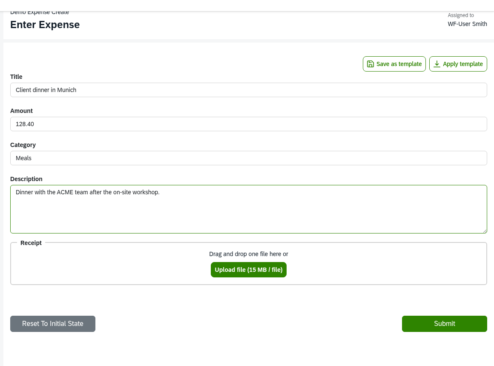

# Workflows

This is the central page for building a workflow inside a workflow project: modelling the BPMN process, writing forms, adding automated steps with service tasks, reacting to messages and timers, translating the workflow and testing it. It is long on purpose; use the section headings to jump.

This handbook illustrates everything with one running example, an **expense-approval** workflow, and this page follows it end to end: an employee submits an expense; small amounts are auto-approved, larger ones go to a finance approver; the approved expense is stored and recorded for finance. The workflow is called `ExpenseApproval`, its employee submit form is `EnterExpense`, and its approver form is `ApproveExpense`. It only illustrates — every fact, table and code block below stands on its own. The mental model of the engine is on [architecture.md](architecture.md); how to create and run the project around the workflow is on [workflow-project.md](workflow-project.md).

## A workflow at a glance

A [workflow](glossary.md#workflow) lives in one folder, the [workflow directory](glossary.md#workflow-directory). The folder name is the workflow name and must equal the BPMN process id. Only the `.bpmn` file and one form per user task are required; everything else is optional.

```
expenses/workflows/ExpenseApproval/
├── ExpenseApproval.bpmn      process id = ExpenseApproval; file name is free
├── EnterExpense.form         one <task id>.form per user task
├── ApproveExpense.form
├── __init__.py               workflow module: service, options, validation functions
├── options/<name>.csv        option files for selects
├── i18n/                     translation catalog (.pot, .po, compiled .mo)
├── <name>.dmn                decision tables for business rule tasks
└── tests/test_<name>.py      pytest files
```

The engine treats every subfolder that directly contains a `.bpmn` file as a workflow; asset folders without BPMN are ignored.

When a user starts the workflow, the engine runs a [workflow instance](glossary.md#workflow-instance). One run executes every automatic task it can (gateways, service tasks, script and rule tasks, events), then stops at the first user task or waiting event and stores the instance. The user submits the task, and the next run advances from there. In the example the first run stops at `EnterExpense`; the employee's submit lets the next run continue through the policy check and approval gateway. This repeats until no task is ready or waiting; then the instance is completed. Service functions run synchronously inside the request that triggered the run, so a slow function delays the user's response.

!!! warning
    A running workflow instance keeps the BPMN and forms it was started with; changing those files affects only new instances. Changed Python code in the workflow module takes effect immediately, because the engine looks the functions up by name every time it loads an instance. After changing BPMN, forms or the activation setting, restart the backend: it caches the transformed forms and a few BPMN properties until it restarts.

## Modelling the process

Model the process in the Camunda Modeler (Camunda 8 profile) and save it into the workflow directory. Set the process id to the folder name (`ExpenseApproval`), mark it executable, and give it a name — the name becomes the workflow title in lists and mails, so "Expense approval". Put every user task into a named lane; give each user task an id you recognise, because the id names its form file and is the key service functions use (here, `EnterExpense` and `ApproveExpense`).

### Lanes, roles and ownership

Custom properties on lanes, the process and user tasks decide who sees, starts and administrates the workflow. Set them in the Modeler's "Extension properties" panel. The example has two lanes: an "Employee" lane that anyone may start, and a "Finance" lane whose tasks only the `expense-approver` role sees.

| Property | On | Value | What it does |
|---|---|---|---|
| `roles` | lane | comma-separated role names | members of these roles see and may take the lane's ready user tasks |
| `initiator` | lane | `true`, `false` or role names | marks the [initiator](glossary.md#initiator) lane: its tasks are auto-assigned to the starter, and the value doubles as the start permission (see below) |
| `notify_role_members` | lane | `true` | mail the lane's role members when a task becomes ready without an assignee |
| `notify_role_members_max` | lane | integer, default 20 | cap on those recipients |
| `wf-owner` | process | one role name | members become [workflow owners](glossary.md#workflow-owner): they administrate this workflow's instances and get its erroneous-task reminder |
| `can_user_cancel_workflow` | user task | `1` | the assignee may cancel the whole instance from the task |
| `can_user_delete_workflow` | user task | `1` | the assignee may delete the whole instance from the task |
| `send_assignment_email` | user task | `no` | suppress the assignment mail and role notification for this task |

In the example the Employee lane carries `initiator = true`, so anyone may start and `EnterExpense` is assigned to the starter; the Finance lane carries `roles = expense-approver`, so `ApproveExpense` reaches the finance approvers; and the process carries `wf-owner = expense-admin`.

The `initiator` value does two things at once: it decides who may start the workflow, and it makes the engine assign the lane's ready tasks to the starter after every run.

| `initiator` on the lane | Who may start | Tasks of the lane |
|---|---|---|
| absent on every lane | every user | visible to role members only |
| `true` | every user | assigned to the initiator |
| role list, e.g. `purchasing, sales` | only members of one of those roles; others do not see the workflow | assigned to the initiator |
| `false` | nobody | visible to role members only |

The first lane in the file that carries the property decides the start permission. A lane with neither `roles` nor `initiator` produces tasks nobody sees until a service function or admin assigns them. Lane settings are frozen into each instance at start, so start a new instance after every change; restart the backend after changing `initiator` or `wf-owner`. A service function can override the roles or assignee of one upcoming task from code — see [Service tasks](#service-tasks).

### Supported BPMN elements

"Supported" means the engine's tests cover the element; "untested" means it loads and ran in a quick check but no test covers it; "not supported" means it fails to load or has no effect.

| Support | Elements |
|---|---|
| supported | start events (none, message), user tasks, service tasks and throw events with a task type, message intermediate catch events, interrupting timer boundary events, exclusive and parallel gateways, embedded sub-processes (with and without multi-instance), script tasks, business rule tasks (DMN), none and terminate end events |
| not supported | timer/signal intermediate catch events, message boundary events, message end events, send tasks, receive tasks, plain and manual tasks (the branch stops or fails to load) |
| untested | timer/error/escalation boundary events, inclusive and event-based gateways, call activities, standard loops |

`ExpenseApproval` uses only supported shapes: two user tasks, two service tasks, one exclusive gateway and an interrupting timer boundary event. A user task without a `<task id>.form`, a diagram without a lane, or a multi-instance with a fixed `loopCardinality` all make the workflow fail to load. Model the common shapes above and check the result in the browser.

### Expressions

The engine evaluates expressions in sequence-flow conditions, timer definitions, multi-instance collections and message correlation keys. In the example, the exclusive gateway after the policy check routes on the amount: the flow to `ApproveExpense` carries the condition `=amount > 1000`, and the default flow auto-approves everything else.

!!! warning
    An expression with a leading `=` is rewritten to Python by text replacement — not run by a real FEEL engine — and everything without `=` is plain Python. So a numeric comparison like `=amount > 1000` is correct here. Keep to simple comparisons and boolean logic, for example `=approve="yes"` or `=amount>1000 and category="Travel"`. A single `=` is equality; use `None`, not `null`. A reference to a missing variable, or an exclusive gateway with no matching flow and no default, puts the task into state error.

Remember this contrast for the next section: `=` expressions on gateways and flows are Python and may use `<`, `>`, `<=`, `>=`; form hide-if expressions may not.

## Forms

Every user task needs a form file named `<task id>.form` next to the BPMN file, built with the Modeler's form editor. The engine converts it into a JSON schema and a UI schema that the browser renders and validates. The key of a component is its key in the [task data](glossary.md#task-data): what the user enters under `amount` is `amount` for service functions, expressions and later forms, and a value a service function stores under `amount` is shown in the field. Keys must not be `root`, `this` or `parent`.



*The `EnterExpense.form` file as the employee sees it: each component's key becomes a task-data key, so `amount` here is the same `amount` the approval gateway reads.*

The example has two forms. `EnterExpense` collects `title` (text, required), `amount` (number, required), `category` (a select), an optional `travel_details` text, a `receipt` file upload and a `description` textarea. `ApproveExpense` shows the same `title`, `amount`, `category` and `description` back to the approver, adds a required `decision` select (`approve` / `reject`) and a `reason` text.

Supported field types: text field, text area, text view (static text), single and multi select, number (optionally with a currency), date and date-time, checkbox, radio, single and multi attachment, and [dynamic list](glossary.md#dynamic-list). Fields carry a label, a description (Markdown, with `{{ <expression> }}` placeholders evaluated in the browser), an optional default, `required`, and `minLength` / `maxLength` on text. Other Modeler validation settings are not enforced; unknown keys are dropped on submit.

### Custom properties

Set these in the Modeler's "Custom properties" panel of a field or list. In `EnterExpense` the `receipt` field carries `custom_type: attachment_single` to become a file upload, and `amount` carries `currency: EUR`.

| Property | Value | What it does | Why you would use it |
|---|---|---|---|
| `custom_type` | `select_multi`, `attachment_single`, `attachment_multi` | turns a select into a multi-select, or a field into a single or multi file upload | multiple choices, or file uploads |
| `options_file` | `<name>.csv` | takes the select's options from `options/<name>.csv` in the workflow directory | a fixed lookup list kept out of the form |
| `options_function` | function name | takes the select's options from a function `<name>(oth)` in the workflow module | options computed at fill time, e.g. from a data model or connector |
| `depends_on` | comma-separated top-level keys | the select clears and reloads its options when one of those fields changes | options that depend on another field |
| `options_limit` | integer, default 15, `0` = unlimited | page size of the dynamic-option search | show more or fewer matches |
| `validation_function` | function name | calls `<name>(vth)` on submit, which can reject the field with a message | checks the schema cannot express, e.g. a lookup |
| `currency` | symbol, e.g. `EUR` | renders a number field as a currency input | monetary amounts |
| `template_field` | `true` / `false` | includes or excludes the field from saved form templates | control what a [form template](glossary.md#form-template) captures |
| `minItems` | integer | minimum row count of a dynamic list, checked while it is visible | require at least N rows |
| `itemgroup_addbutton` | text, default `Add` | label of the list's add button | a clearer button text |
| `itemgroup_overviewbutton` | text, default `Overview` | label of the list's overview button | a clearer button text |

A dynamic list stores an array of row objects; the fields inside it are the row's fields, and the engine stamps a technical [row id](glossary.md#row-id) into every row automatically — you never model it. Its key must not contain `-`. Row-level and backend-owned values survive when the user reorders or deletes rows; the reasoning is in [ADR 010](adr/adr_010_dynamic_list_row_identity.md). Nested lists work the same way.

### Conditional fields (hide-if)

Set a component's "Hide if" condition to an expression starting with `=`. The browser hides the field while the condition is true and re-evaluates on every change; the server drops the values of hidden fields on submit, so a hidden field never reaches the task data and never blocks the submit. In `EnterExpense`, `travel_details` is shown only for travel expenses, with the hide-if `=category != "Travel"`; in `ApproveExpense`, `reason` is shown only for a rejection, with `=decision != "reject"`.

!!! warning
    The server evaluates hide-if with a subset of FEEL: `=`, `!=`, `and`, `or`, references with `this.` and `parent.`, and string, number, boolean and `null` literals. The browser evaluates full FEEL. Keep hide-if expressions inside the subset, otherwise browser and server disagree. This is the contrast with gateway expressions: a gateway may write `=amount > 1000`, but a form hide-if must stick to equality and boolean logic — never `<`, `>`, `<=`, `>=`. Inside a dynamic list write `this.<key>` for a field of the same row and `parent.<key>` for the enclosing row.

How the field-level flags interact with hide-if:

| Flag | While the field is hidden | On submit |
|---|---|---|
| `required` / `minItems` | suspended; an empty hidden field does not block the submit | enforced only if the field is visible |
| `disabled` | shown read-only; the value is owned by the server | the browser's value is ignored; the stored value wins, else the field's default |

A `disabled` field therefore shows a backend-owned value the user may not change. This is exactly how `ApproveExpense` shows `title`, `amount`, `category` and `description`: they are marked `disabled`, so the approver sees what the employee entered but cannot edit it, and on submit the engine keeps the stored values. A hidden disabled value is dropped like any hidden value.

### Options

A select takes its choices from one of three sources; radios use static values only. The example's `category` uses static values `Travel`, `Meals`, `Equipment`.

| Source | How | Notes |
|---|---|---|
| static values | fill "Values" in the Modeler | translatable labels, delivered with the form |
| CSV file | `options_file: <name>.csv` in `options/` | `;`-separated, first line is a header, first column value, second label; loaded while filling |
| function | `options_function: <name>`, write `<name>(oth)` in the workflow module | returns `(value, label)` pairs; `oth` carries the current form data, so options can depend on other fields |

```
key;label
cat_alpha;Alpha Category
cat_beta;Beta Category
```

```python
def categories(oth):
    return [("cat_alpha", "Alpha Category"), ("cat_beta", "Beta Category")]
```

Dynamic options are searched on the server and cut to `options_limit`. On submit the value must be one of the options; for a function, the function runs again with the submitted data. Option labels from files and functions are not translated by the engine.

### Validation functions

Set `validation_function: <name>` on a field and write `<name>(vth)` in the workflow module. The engine calls it on every submit that passes the schema checks; the function reads `vth.form_data` and rejects the value with `vth.raise_error("<message>")`, which shows the message at the field and keeps the task open. Use it for checks the schema cannot express, for example a lookup through a connector or a data model.

## Service tasks

A [service task](glossary.md#service-task) runs an automated step. Give it a "Task definition" type in the Modeler, for example `post_expense` (the Modeler writes `zeebe:taskDefinition type="post_expense"`). The engine then calls the [service function](glossary.md#service-function) `service_post_expense` from the workflow module with a [task helper](glossary.md#task-helper), conventionally named `sth`. A return value must be JSON-serialisable; the engine stores it in the task data under `result_<task id>` and the following tasks inherit it. An intermediate throw event with a task definition behaves the same way — that is how you model "send something to another system"; no BPMN message is thrown.

The example has two service tasks. `check_policy` runs right after `EnterExpense` and returns whether the amount needs approval, a stored value the gateway (or a later task) can then reason about:

```python
def service_check_policy(sth):
    return sth.task_data.get("amount", 0) > 1000
```

The second service task, `post_expense`, runs after approval and stores the expense as an [Expense](data-models.md) data-model record — a versioned table the engine hosts, so the approved expense outlives the workflow instance. A workflow may only touch models it lists in the module-level `DATA_MODELS` allow-list:

```python
from actidoo_wfe.wf.service_task_helper import ServiceTaskHelper

DATA_MODELS = ["Expense"]


def service_post_expense(sth: ServiceTaskHelper):
    Expense = sth.get_model("Expense")
    row = Expense(
        workflow_instance_id=sth.workflow_instance_id,
        action="CREATE",
        title=sth.task_data.get("title"),
        amount=sth.task_data.get("amount"),
        category=sth.task_data.get("category"),
        description=sth.task_data.get("description"),
        status="open",
    )
    sth.db.add(row)
    receipt = sth.task_data.get("receipt")
    if receipt:
        sth.attach_files(row, "receipt", receipt)
    sth.db.flush()
```

It reads the form values from `sth.task_data`, stamps the provenance (`sth.workflow_instance_id`) so the record remembers which instance wrote it, and adds the row through `sth.db`. `attach_files` records the uploaded `receipt` against the row's `receipt` field, and `sth.db.flush()` writes it out. The `Expense` model definition, its API config and how it is exposed on the Data page are on [data-models.md](data-models.md).

When the function raises, when no function of that name exists, or when the return value is not JSON-serialisable, the task goes to state error with its stack trace; the other ready branches keep running, and admins and workflow owners are notified. Fix the code (running instances use the new code immediately) or the data, then retry from the admin area. Retrying re-runs the function from the start, so make external calls safe to repeat.

### What the task helper offers

`sth.task_data` is the running task's data dictionary; write it with `sth.set_task_data({...})` or `sth.set_task_data_key(key, value)`. Pass the BPMN task id (not the form file name) to the methods that take one.

| Group | Key methods |
|---|---|
| task data | `set_task_data`, `set_task_data_key`; read `task_data["<field key>"]`, `task_data["result_<task id>"]`, `task_data["<event id>_Response"]` |
| workflow control | `set_workflow_data` (instance-level values forms never see), `set_workflow_instance_subtitle`, `get_task`, `get_last_completed_task`, `get_task_completion_day` |
| users & assignment | `get_created_by`, `get_users_of_role`, `get_user_by_task_name`, `get_user_by_id`; `assign_user_without_role("<task id>", "<email>")` assigns and hides the next such task; `assign_task_roles("<task id>", [...])` replaces its lane roles |
| mails | `send_text_mail(subject, content, recipients, attachments)`; `get_mail_attachments("<field key>")` turns uploaded files into the attachments argument |
| attachments | `add_attachment_to_task_data(file, "<name>", "<ext>", "<field key>")` stores a generated file like an upload; `get_attachment_by_hash(hash)` reads one back |
| data models | `get_model("<name>")` opens a model listed in `DATA_MODELS`, and `attach_files` / `clear_files` manage its file fields; see [data-models.md](data-models.md) |
| connectors | `get_connector("<type>", "<instance>")` in a `with` block opens a configured connection; see [connectors.md](connectors.md) |

Keep service functions short; long-running work belongs in a background task. Task data must stay JSON-serialisable, and values of hidden form fields are removed after every run, so do not rely on them later.

## Messages and timers

A workflow can start or continue from another system through a [message](glossary.md#message), and put a deadline on a user task with a timer.

Model a message start event and give its message a name, for example `order_received`; the name is the only thing that matters for a start (a correlation key is ignored). To continue a running instance, model an intermediate message catch event and give its message a [correlation key](glossary.md#correlation-key) — a `=`-prefixed expression over the task data, kept to a simple field reference like `=order_id`. The engine evaluates it per instance so an incoming message reaches exactly the right one. In both cases the payload lands in the task data under `<event id>_Response`.

An external system sends a message with a `POST` to [API v1](glossary.md#api-v1), authenticated with a [bearer token](glossary.md#bearer-token) that carries the client role `wf-api`:

```
POST /api/wfe/api/v1/send_message
Authorization: Bearer <access token>
Content-Type: application/json

{ "message_name": "order_approved", "correlation_key": "4711", "data": { "decision": "yes" } }
```

Use `correlation_key` for a catch event; send an empty string for a start message. The call only stores the message; the engine delivers it on its next scheduled run, so processing is not immediate. A message-started workflow has the [service user](glossary.md#service-user) as initiator, so a lane that restricts starting to a role list blocks a message start (a service user has no roles).

For a deadline, attach an interrupting timer boundary event to a user task (keep "Cancel activity" on) and set a `=`-prefixed duration string, for example `="P3D"` for three days or `="PT5M"` for five minutes. In the example, a three-day timer on `ApproveExpense` catches an approval that stalls: when it is due, the user task is cancelled and the flow leaves the boundary event into a service task that reminds finance. The engine checks due timers on a schedule, so a timer fires shortly after its due time, not to the second.

## Translations

The engine translates process, lane and user-task names, form labels, descriptions, text views and static option labels at read time, per user [locale](glossary.md#locale), from a gettext [catalog](glossary.md#catalog) in the workflow's `i18n/` folder. So the `Travel` / `Meals` / `Equipment` labels and the form field labels get German translations, while dynamic option labels (from a CSV file or a function) and the workflow instance subtitle do not. Run these commands in the environment where the workflow's provider is registered (the devcontainer):

```
python -m actidoo_wfe.wf.cli_i18n extract ExpenseApproval
python -m actidoo_wfe.wf.cli_i18n update ExpenseApproval de
python -m actidoo_wfe.wf.cli_i18n compile-all
```

`extract` reads the workflow's `.bpmn` and `.form` files and writes the template `i18n/ExpenseApproval.pot`. `update` creates or merges `i18n/locales/de/LC_MESSAGES/ExpenseApproval.po` for a locale folder — new texts are added untranslated, a changed text keeps its old translation marked `fuzzy` for review. Fill in each `msgstr`, remove the `fuzzy` marker once checked, and commit the `.pot` and `.po` files. Name locale folders with hyphens (`de`, `de-CH`); a user with `de-DE` is served by the `de` folder through base-language matching.

!!! warning
    The engine reads only compiled `.mo` files and never compiles `.po` at build or start. Run `compile-all` and ship the resulting `.mo` files, or translations are simply absent in the deployment. Make it part of your build.

## Testing a workflow

The engine ships a pytest plugin that drives the same engine as production: it starts a real workflow instance, submits tasks with data, and lets you assert on the task data. It needs a real MySQL database (the devcontainer provides one); for each test it drops and recreates a dedicated test database and runs the migrations, so tests never touch your development data. Enable it in a `conftest.py` at the root of your tests:

```python
pytest_plugins = ("actidoo_wfe.testing.pytest_plugin",)
```

A test for the example starts an instance as an employee, submits a small expense, and asserts the policy check cleared it for auto-approval:

```python
def test_expense_auto_approved(db_engine_ctx):
    with db_engine_ctx():
        wf = WorkflowDummy(
            db_session=SessionLocal(),
            users_with_roles={"clerk": ["wf-user"]},
            workflow_name="ExpenseApproval",
            start_user="clerk",
        )
        wf.user("clerk").assign_submit(
            wf.workflow_instance_id,
            {"title": "Taxi", "amount": 100, "category": "Travel"},
        )
        wf.assert_completed()
```

`assign_submit` takes the single ready user task, assigns it to the user and submits the form data; a larger amount would instead stop at `ApproveExpense`, which `get_usertasks(wf.workflow_instance_id, 1)` returns and asserts the count of. Mock side effects so a test runs on its own: request the `mock_send_text_mail` fixture to capture mails as a list, and declare `mock_connector_instance("o365", "finance")` at module scope so the finance-workbook connector returns a stub instead of reaching a real system. To resume a waiting instance, `wf.service_user(...).send_message(...)` sends a message and `wf.trigger_timer_events(timer_bpmn_id=...)` fires the approval-reminder timer. Each test starts from a fresh database, so order does not matter.

## Related

- [architecture.md](architecture.md) — how the engine finds and runs a workflow
- [connectors.md](connectors.md) — develop the `o365` connector `post_expense` calls
- [data-models.md](data-models.md) — define and expose the `Expense` model a workflow reads and writes
- [operations.md](operations.md) — activate a workflow (`WORKFLOWS`) and deploy the project
- [ADR 001](adr/adr_001_form_i18n.md) — per-workflow gettext catalogs
- [ADR 008](adr/adr_008_form_templates.md) — form templates
- [ADR 010](adr/adr_010_dynamic_list_row_identity.md) — row identity in dynamic lists
